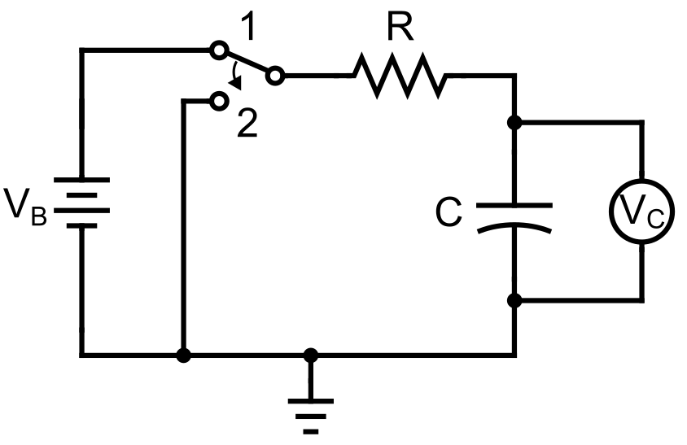
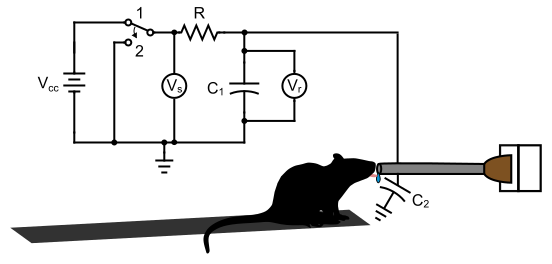

# Capacitive sensor
## Theory
Capacitive sensing relies on, as the name suggests, the capacitance of the involved circuit. Capacitance, in turn, is the ability to store electrical charge under an applied voltage, which is employed by components termed capacitors. Clasically, capacitors can be visualized as two conductor plates separated by some distance $d$; the capacitance of these "parallel plate capacitors" is then governed by the equation:

$
C = \dfrac{Q}{V} = \epsilon \dfrac{A}{d}
$

where $Q$ is the electrical charge stored on conductor plate; $V$ is the voltage applied to the capacitor; $\epsilon$ is the dielectric constant of the medium separating the plates; $A$ is the area of each plate; and $d$ is the distance between the plates.

Once charged after application of a voltage across the conductor plates (by, for example, a battery), the capacitor will similarly discharge across another component of a circuit if provided the opportunity. For example, consider the simple RC circuit below.

When connected to the battery, the capacitor with capacitance $C$ will store an amount of charge $Q$ after equilibrating at the battery voltage $V_B$ (position 1). If the circuit is disconnected from the battery (position 2), then an electric current will flow from the positively charged capacitor plate across the resistor to ground. The time-dependent voltage across the capacitor, $V_C$ follows a well-known exponential decay:

$V(t) = V_B e^{-\frac{t}{\tau}}$

where $\tau = RC$ is known as the time constant of the circuit and is given by the product of the resistance and capacitance. (Similarly, reflecting the equation across the time axis gives the time-dependence for charging the capacitor.)

Lastly, it can be shown that for capacitors placed in parallel in an electrical circuit, the capacitance of the circuit is the sum of the individual capacitances of each capacitor:

$$
\displaystyle
C_{tot} = C_1 + C_2 + \cdots + C_n
$$

In other words, capacitance is additive in parallel.

How do these principles apply to capacitive sensing? Let's suppose that we have the RC circuit similar to the one above, except that we have an additional wire that connects the positive terminal to a conductive plate (i.e. one-half of a parallel plate capacitor). As some object object, say a finger, approaches this plate, it can form the other (negative) plate to generate an additional parallel plate capacitor. Moreover, if this object is connected to a large electrical reservoir, like a human body, it is in effect "virtually grounded", which functionally acts as if connected to the circuit ground, and thereby makes the new capacitor lie in parallel with the known capacitor. Consequently, because capacitance adds in parallel, the new capacitance of the circuit will have increased. (The exact amount is not important, as we will see.) (If placed directly between the plates of a large capacitor, the sensed object can also affect capacitance by altering the dielectric field; however, this principle is not applicable to this setup.)

How do we measure this change in capacitance? By relying on the time constant of the RC circuit! After charging the capacitor(s), the battery is disconnected, and the rate of voltage decay across the capacitor can be measured. As the sensed object (finger) approaches the sensor (plate), the overall capacitance of circuit increases. Because the resistance is fixed, the time constant is only modified by the change in capacitance and consequently increases as well. Thus, the time for the voltage to decrease by a given amount is prolonged. (We could similarly measure the time to charge the capacitor and see that it is also prolonged with increased capacitance.)

Although the voltage change during discharge theoretically follows an exponential decay, it often not necessary to model the voltage decay as such, nor to solve for $\tau$ directly. As mentioned above, the change in capacitance will alter the time to reach certain voltage thresholds during discharge in a predictable direction. The codebase on which this sensor is based counts the number of cycles on the microcontroller until logic LOW is reached as a rough estimate of this duration. An increase or decrease in this output reflects an increase or decrease, respectively, of the circuit capacitance.

The implementation of capacitive sensing for lick detection is shown below. An RC circuit is run on a microcontroller that toggles between charging (position 1) and discharging (position 2) the integrated capacitor ($C_1$). Additionally, a wire connects the positive terminal to the metallic lick spout, which functions as one end of a capacitor. During licking, as the tongue approaches the lick spout, it functions as the other end of the capacitor ($C_2$), thereby increasing the capacitance of the RC circuit and, consequently, the time constant, a detectable change as noted above. The tongue is connected to the animal's body and perhaps, depending on the specifics of the experimental rig, the material on which the animal is sitting; in either case, the electrical storage capacity is large enough relative to the circuit that it functions as a virtual ground for the "other" plate of the capacitor. (Although the tongue does touch the lick spout during licking, the specifics of whether the sensor is detecting proximity or contact is less important. For instance, even when in contact with the lick spout directly, the intervening reward solution and saliva, as well as the epithelial layer of the tongue, can be modeled as the dielectric material separating the capacitive plates for a capacitor, albeit a potentially leaky one.) 

The change in charging or discharging time in the RC circuit is detected by a script running on the microcontroller. Both a "send" pin and a "receive" pin are initially set to logic LOW in an output state. The send pin is then switched to logic HIGH ($V_s$), while the receive pin is switched to an input state. A counter tracks the number of clock cycles until the voltage of the recieve pin ($V_r$) reaches the logic HIGH state (i.e. capacitor charging). Once the capacitor is fully charged, the reverse occurs to track capacitor discharging. Full implementation details can be found at the developers' repository [here](https://github.com/PaulStoffregen/CapacitiveSensor).

## Overview of sensor
### Hardware
The capacitive sensing components are integrated onto a small printed circuit board (PCB) that was designed using Autodesk EAGLE (v9.5). Files pertaining to the PCB, including design files and parts lists, can be found in the `pcb` directory. A schematic is shown below.

The sensor uses a microcontroller (Adafruit M0 Trinket; component **1** in diagram) that gathers the sensing input, runs the lick detection firmware (more below), and outputs the lick signal. It requires a 3.3V power source (but is tolerant up to 6V) that may be provided either directly through the micro USB hub or through the audio jack (**4**) via an external source that may be switched on or off (**5**). The components of the sensing circuit are the thru-hole for a wire connected to the lickspout (**8**); a fixed (**2**) and variable (**6**) resistor (comprising $R$ in circuit diagram above); a stabilizing capacitor (**3**, comprising $C_1$ in diagram above); and, if needed, a thru-hole for a separate ground connection (**9**). The voltage from this modified RC circuit is fed as input into a pin on the microcontroller in order to run lick detection firmware. The sensitivity of lick detection can be adjusted manually by tuning the specified variable resistor (**7**).

The output signal is sent via a different microcontroller pin to the signal component (ring of tip-ring-sleeve, or TRS, composition) of the audio jack. Additionally, the red status LED turns on whenever a lick is detected (i.e. HIGH signal output).

### Firmware
The firmware that runs lick detection can be found under the `firmware` directory. Three different scripts (`capacitiveSensor`, `capacitiveSensorFilter`, `capacitiveSensorVariable`) run a common algorithm with slightly different variants. The input voltage from the lick detection circuit is fed to the [CapacitiveSensor](https://github.com/PaulStoffregen/CapacitiveSensor) library to provide a rough estimate of the time constant, which is returned as a unitless number. Larger values mean larger time constants and a higher likelihood of a lick occurring. Once the value exceeds a set threshold, a lick is detected and the signal output set to HIGH. That threshold can be fixed in the firmware (`capacitiveSensor.ino`) or modified within a range by the variable resistor knob on the PCB (`capacitiveSensor.ino`). Lastly, the time constant values instead may be first fed through a filter (`capacitiveSensorFilter.ino`; moving average or median filter) in order to smooth the input signal. Explanations of the parameters within and use of each script is provided below in `Usage Guide`.

## Installation
The PCB design files and a list of hardware components can be found in the `pcb` directory. Once acquired, the surface-mount (R1, C1) and through-hole (trimpots, power switch, audio jack) components should be soldered to the PCB. Pin headers should be soldered to the PCB and to the microcontroller, which can be then be mounted onto the board.

Next, an insulated wire should be measured and cut to the desired length, noting that it will be connected to the through-hole labeled `SENSE` at one end and to the lickspout at the other. The length of wire should allow for enough slack to avoid pulling on either component but avoid excess slack, which will increase the noise of the input (as it essentially functions as an antenna). We suggest first soldering the wire to the lickspout and then soldering the other end to the through-hole.

After all components have been soldered to the board, the microcontroller should be programmed with the firmware of choice. A computer containing the firmware files can be connected to the microcontroller via its micro USB hub. Either the Arduino IDE (which can be downloaded [here](https://www.arduino.cc/en/software)) or software with Arduino integration (e.g. VS Code) may be used to upload the firmware. A detailed guide to installing the IDE and uploading scripts can be found [here](https://learn.adafruit.com/adafruit-trinket-m0-circuitpython-arduino/arduino-ide-setup). The three scripts that may be uploaded are `capacitiveSensor.ino`, `capacitiveSensorFilter.ino`, and `capacitiveSensorVariable.ino`. If using `capacitiveSensorFilter.ino`, the binaries for the files located in `firmware/libaries` must be compiled to a location within `firmware` (such as `firmware/bin`).

Once the hardware and firmware installation is complete, the microcontroller may be powered by either the audio jack via an external power supply or the microUSB port. In either case, it requires a 3.3 V power supply but is tolerant up to 6 V. If the audio jack is used, the power and ground should be connected to the tip and sleeve of the cable, respectively. Note that if the microUSB port is connected to a host computer, then power will automatically switch over even if an external power source is connected to the audio jack.

The output signal may be harnessed from either pin 3 on the microcontroller or the ring component of the audio jack. The output is logic LOW when no lick is detected and logic HIGH when a lick is detected.

## Usage guide
The sensor may be quickly tested by touching the peripheral end of the sense wire or the component to which it is connected (e.g. a lickspout). The red status LED on the microcontroller should turn on when the component is touched and only when it is touched. If the status light does not illuminate, first attempt to modify the settings below before proceeding to the Troubleshooting section.

As with many sensors, there is a trade-off between the sensitivity (capturing lick events) and specificity (ignoring noise) of detection, of which the sensor has two primary means of adjusting: via hardware and via firmware.

The knob on the variable resistor (trimpot) labeled `R CIRCUIT` tunes the resistance of the RC circuit that underlies lick detection. By turning it clockwise, the resistance is increased, which in turn increases the sensitivity of the detector. (Specifically, the time constant is increased via the $R$ in $\tau=RC$; any changes in the capacitance $C$ are then amplified in the read-out value on which detection is thresholded.) Larger values may reliably detect proxmity rather than touch if desired.

Each script has modifiable parameters that govern its sensitivity to lick detection. The most straightforward is the detection threshold, which, using output values from the underlying `CapacitiveSensor` library, delineates between the baseline state (below threshold) and lick state (above threshold). The detection threshold may be hard-coded (in `capacitiveSensor.ino`) or adjusted via the knob on the trimpot labeled `THRESH` (in `capacitiveSensorVariable.ino` and `capacitiveSensorFilter.ino`). In the latter case, the range of values corresponding to the knob position are set by the low and high limits coded in the script. All scripts are specify the sampling rate, which corresponds to the frequency with which sensor values are sampled and compared to threshold. If filters are employed (`capacitiveSensorFilter.ino`), several other parameters specify various properties of the filter that affect detection speed and accuracy; these are explained in further detail in the iPython notebook found at `testing/python/filters.ipynb`. The full list of parameters is displayed in the table below.

| parameter | variable name | description | script(s) |
|-----------|---------------|-------------|-----------|
| sampling rate | `sampleRate` | rate of sensor value acquisition | `capactiveSensor`, `capactiveSensorVariable`, `capactiveSensorFilter` |
| threshold | `th`, `thresh` | value above which the output signal is HIGH | `capactiveSensor`, `capactiveSensorVariable`, `capactiveSensorFilter` |
| lower limit of threshold | `th_low`, `thresh_low` | threshold value when `THRESH` set to lowest setting | `capactiveSensorVariable`, `capactiveSensorFilter` |
| upper limit of threshold | `th_high`, `thresh_high` | threshold value when `THRESH` set to highest setting | `capactiveSensorVariable`, `capactiveSensorFilter` |
| algorithm sensitivity | `sensitivity` | number of cycles to estimate time constant | `capactiveSensorFilter` |
| threshold type* | `method` | specifies threshold based on absolute values or z-score | `capactiveSensorFilter` |
| coefficient of signal value* | `alpha` | contribution of signal to filter buffer stats | `capactiveSensorFilter` |
| filter duration* | `tFilter` | duration of filter buffer (seconds) | `capactiveSensorFilter` |
| downsample factor* | `k` | specifies period for updating filter buffer |  `capactiveSensorFilter` |

*See `testing/python/filters.ipynb` for details.

## Troubleshooting
**General debugging**: Each firmware script is programmed to output debugging values every iteration as listed in the table below. When the microcontroller is connected to a host computer via its microUSB hub, these values can be accessed either through the serial monitor or by piping the output to a text file. Each row represents values for a given iteration, and values within an iteration are separated by a whitespace.

| firmware | default frequency | values | | | | |
|---|---|---|---|---|---|---|
`capactiveSensor` | 30 kHz | timestamp (microseconds) | sensor value | | | |
`capacitiveSensorVariable` | 30 kHz | timestamp (microseconds) | sensor value | detection threshold | | |
`capacitiveSensorFilter` | 0.2 kHz | timestamp (microseconds) | sensor value | detection threshold | buffer mean | output |

**Error occurs while attempting to upload firmware**: Make sure that both the Adafruit and the Arduino libraries for the SAMD21 boards are installed in board config (see tutorial [here](https://learn.adafruit.com/adafruit-trinket-m0-circuitpython-arduino/arduino-ide-setup)).

**Microcontroller not recognized by computer (i.e. does not mount)**: Try resetting the microcontroller by (1) double clicking the reset button on the microcontroller to enter bootloader mode (red LED should flash on and off), and then (2) dragging the appropriate UF2 file into the newly mounted controller (see [here](https://learn.adafruit.com/introducing-itsy-bitsy-m0/uf2-bootloader-details) for details). 